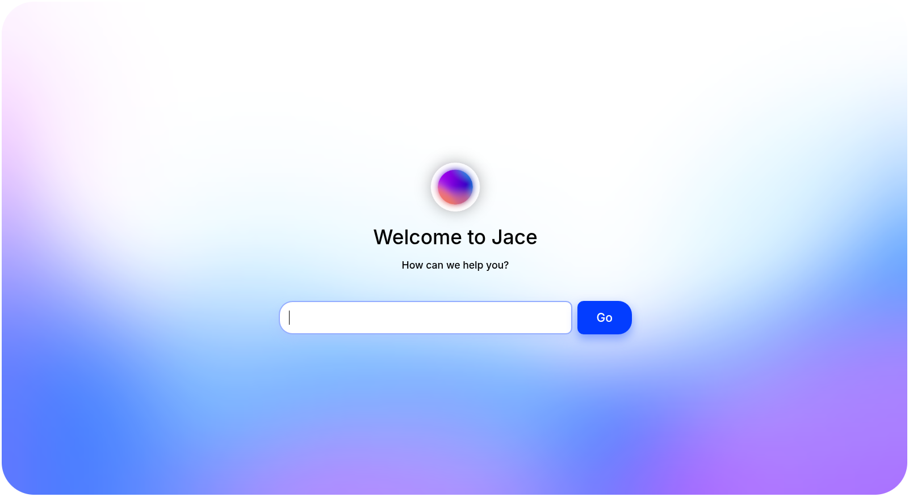

    

<h1 align="center">Jace</h1>

    <i>Mix your favorite LLMs together with ease</i>

Jace is my reference implementation of a method I call "**council of models**" (CoM) that makes several LLMs discuss problems or prompts with each other to reflect on different standpoints. [Showcase video here](./docs/assets/showcase-small.webm).

This makes you able to **mix many different LLMs** and get one final, merged answer at the end - helping to reduce hallucination and somewhat mitigating censorship, no fancy modifications to the models needed at all.

Jace also supports instantly generating diagrams as soon as you mention them using Mermaid. Just write something like "Make me a chat about ..." and watch the magic happen!

> [!TIP]
> Want to get started? It's just three commands!
>
> 👉 [How to install](./docs/install.md)

## How it works

This project uses the Ollama API to run several models at once and query them with each other's ideas on how to solve a given problem or fulfill a request.

The basic steps for problem solving are as following:

1. A model chosen as the "proposing" one comes up with the first idea on how to solve the problem and tells it to the council.
2. The other models in the council are asked what they think about the idea, proposing other ideas when necessary.
3. Only if every review model writes out the words "\<approve\>", the process finishes.
4. Lastly, the original "proposing" model summarizes the findings for the user.

## Prompts

If you want to see the prompts used with Jace, look at [this document](./docs/prompts.md)!
